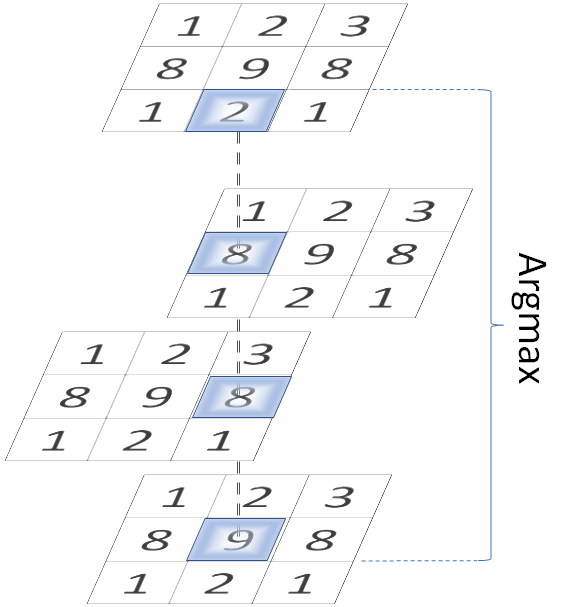
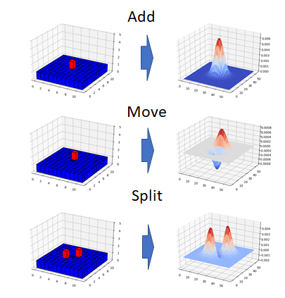
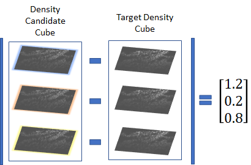
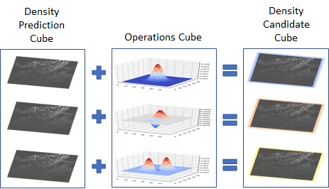

# lora
LOcation Reconstruction Algorithm - Reconstructs the locations that might give rise to a given density map.

This is optimised to use a density map created by a modified version of CSRNet. This verison of CSRNet is trained with a target that is create by convolving all truth location annotations with a Gaussian kernel. This allows LORA to work out the locations that, when convolved, would generate a similar density map.

LORA can be run using run_lora.py.

# How LORA Works

## Step 1 - Initialise Locations
This can be done by checking each pixel and seeing whether setting it to '1' would result in a density map that is closer to the target density map. If it is, the pixel is set to '1'.

A faster way to do this is to use Non-Maximum Suprresion. Non Maximum Suppression involves finding the pixels in the target density map that are surrounded by less bright pixels. This can be a very slow process if done as a naive exhaustive search of every candiate pixel’s neighbours. A faster way is to do it in CUDA.

LORA does it by stacking nine copies of the target density map into a cube, where each layer is offset by one pixel.

Each column will contain nine numbers. If the bottom number is the largest, that pixel is a local maximum.

## Step 2 - Visit and Operate on Each Locations

To adjust the locations to get them just right, we must check each location and see if applying an operation to the location improves the match with the density map.

LORA supports 14 different operations. Each one has an effect on the locations before and after they are convolved.

The effects of these operations on both the locations and the resulting density map candiates are precomputed to save time.

The locations are stacked in the CUDA memory into a cube with 14 layers.

One operation is performed on each layer, resulting in a cube with the effect of each operation in each layer.

The layers of the cube are each compared to the target density map. The layer with the least difference represents the operation that worked best.

# References

I'd like to acknowledge Li et al for their paper 'CSRNet: Dilated convolutional neural networks for understanding the highly congested scenes' and posting their code for public use. The CSRNet code can be found [here](https://github.com/leeyeehoo/CSRNet-pytorch).